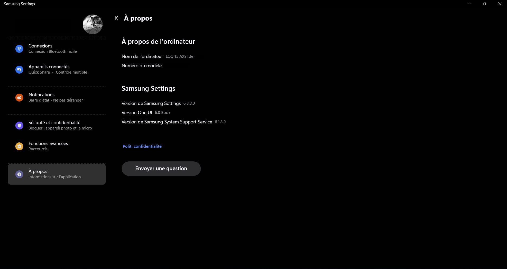

# SamsungSystemSupportEngine 6.3.3.0 Patched for Non-Samsung Devices

**Enable Samsung Multi Control (and potentially other features) on your Non-Samsung Laptop!**

This repository contains a patch for `SamsungSystemSupportEngine.exe` that allows you to use some Samsung features that may require Samsung Settings, most notably **Samsung Multi Control**, on laptops that are *not* manufactured by Samsung.

**Why is this patch needed?**

Samsung software, like Multi Control and Samsung Settings, are most likely to include checks to ensure they are running on genuine Samsung hardware. Without these checks being bypassed, these features either won't function/crash on non-Samsung devices. A common instance is a crash in `SamsungSystemSupportEngine.exe` with a `ucrtbase.dll` error when `Samsung Settings` is launched on a non-Galaxy Book.

**What does this patch do?**

This patch modifies a single instruction within `SamsungSystemSupportEngine.exe` to bypass a hardware check related to ACPI driver and device verification as the support engine checks for a driver named `Samsung Event Controller`, this driver makes calls to an ACPI device named `SCAI` and is only present on Galaxy Books. Installing this driver on a device not manufactured by samsung will just make it fail to start with Code 10 instruction is not supported.

**Additionnal infos**
The engine doesn't start automatically as this is done by another driver (Samsung System Support Engine ¯\_(ツ)_/¯) and requires you to make a service to start it automatically on boot.

**Not related to the Settings directly** : the Samsung Cloud app will NOT sync Wifi and Bluetooth if you have Encrypt synced data on as:
- It requires Secure Boot to be enabled (Will say Knox Matrix did not respond)
- Knox Matrix Service can only be ran on x86/64 **Galaxy Books** (On non-Galaxy Books it will say the device doesn't support encryption with error code 0x1001)

**Enjoy some more unlocked Samsung features on your non-Samsung device! And reminder to use 6.3.3.0 from https://www.catalog.update.microsoft.com/Search.aspx?q=Samsung%20System%20Support%20Service%20 !**

